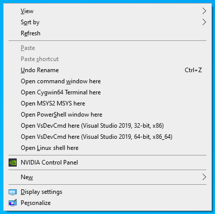

# Windows Shell Keys



These are some registry tweaks that I have created to boost my own productivity as a software developer who occasionally works on a Windows 10 system. They add context menu entries to Windows Explorer for launching various types of CLI shells that I use (like WSL and Cygwin).

## Hold down shift (or not)

These registry files follow my personal preference. It is my preference to not clutter up the context menus, so all of these tweaks require holding down the shift key while right clicking. You can make one of the entries persistent (visible without holding shift) by removing the ```"Extended"=""``` line from the corresponding file.

## Disclaimer

No lifeguard on duty! This code comes with no guarantee that it won't break things (or that it even works, for that matter!).

## License

Technically, I'm not licensing this stuff. In fact, I dedicate this repository to the public domain via [the aptly-named Unlicense](LICENSE).
